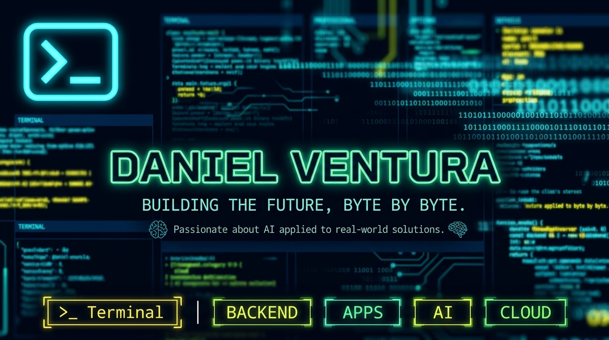

<!-- ============================================ -->
<!--              BIENVENIDA TECH                 -->
<!-- ============================================ -->

#  **WELCOME TO MY DIGITAL UNIVERSE** 🌌

### _// SYSTEM.INIT() // WELCOME_PROTOCOL_ACTIVATED \\_

<!-- Stickers tecnológicos animados -->

  <table>
    <tr>
      <td align="center"></td>
      <td align="center"></td>
      <td align="center"></td>
      <td align="center"></td>
      <td align="center"></td>
    </tr>
  </table>

<!-- Línea divisoria tecnológica -->

  

<!-- ============================================ -->
<!--                 BANNER                       -->
<!-- ============================================ -->

  
  ## 🎨 **BANNER PERSONAL**
  
  <!-- Espacio para tu banner - Reemplaza con tu imagen -->
  
  
    
  
  <!-- Badges decorativos -->
  
  
  
  

<!-- ============================================ -->
<!--              PERFIL PRINCIPAL                -->
<!-- ============================================ -->

# ‍💻 **DANIEL VENTURA**

### `// Full Stack Developer in Progress`

<!-- ============================================ -->
<!--              SOBRE MI                        -->
<!-- ============================================ -->

##  **ABOUT ME**

  <table>
    <tr>
      <td align="center" style="background: linear-gradient(135deg, #0a0a0a 0%, #1a1a2e 100%); padding: 20px; border-radius: 15px; border: 2px solid #7ED321;">
        
          
        <b style="color: #7ED321; font-size: 18px;">👨‍💻 Developer</b>
         
        <small style="color: #F8E71C;">Software in Training</small>
      </td>
      <td align="center" style="background: linear-gradient(135deg, #0a0a0a 0%, #1a1a2e 100%); padding: 20px; border-radius: 15px; border: 2px solid #F8E71C;">
        
          
        <b style="color: #F8E71C; font-size: 18px;"> Location</b>
         
        <small style="color: #50E3C2;">Sonsonate, El Salvador</small>
      </td>
      <td align="center" style="background: linear-gradient(135deg, #0a0a0a 0%, #1a1a2e 100%); padding: 20px; border-radius: 15px; border: 2px solid #50E3C2;">
        
          
        <b style="color: #50E3C2; font-size: 18px;">☁️ Cloud</b>
         
        <small style="color: #7ED321;">Cloud Computing Fan</small>
      </td>
    </tr>
  </table>

 

  

<!-- ============================================ -->
<!--              TECH STACK                      -->
<!-- ============================================ -->

## ️ **TECH STACK**

### ⚡ **Backend Arsenal**

### 📱 **Mobile & Frontend**

### 🗄️ **Database & DevOps**

<!-- Iconos animados de tech stack -->

   
  
    
  
  <!-- Stickers de programación -->
  
  
  

<!-- ============================================ -->
<!--              LEARNING                        -->
<!-- ============================================ -->

## 🚀 **CURRENTLY EXPLORING**

<table>
  <tr>
    <td align="center" style="background: linear-gradient(135deg, #7ED321 0%, #F8E71C 100%); padding: 20px; border-radius: 15px; border: 3px solid #000;">
      
        
      <b style="color: #000; font-size: 16px;"> Docker</b>
       
      <small style="color: #000;">Containerization & Orchestration</small>
    </td>
    <td align="center" style="background: linear-gradient(135deg, #50E3C2 0%, #006699 100%); padding: 20px; border-radius: 15px; border: 3px solid #000;">
      
        
      <b style="color: #000; font-size: 16px;">🏗️ Architecture</b>
       
      <small style="color: #000;">Software Design Patterns</small>
    </td>
    <td align="center" style="background: linear-gradient(135deg, #006699 0%, #7ED321 100%); padding: 20px; border-radius: 15px; border: 3px solid #000;">
      
        
      <b style="color: #000; font-size: 16px;">⚡ Scalable APIs</b>
       
      <small style="color: #000;">Microservices & REST</small>
    </td>
  </tr>
</table>

<!-- ============================================ -->
<!--              GITHUB STATS                    -->
<!-- ============================================ -->

##  **GITHUB UNIVERSE**

<table>
  <tr>
    <td>
      
    </td>
    <td>
      
    </td>
  </tr>
</table>

 

<!-- Streak Stats -->

 

<!-- Trophies -->

<!-- ============================================ -->
<!--              CONNECT                         -->
<!-- ============================================ -->

##  **CONNECT WITH ME**

<table>
  <tr>
    <td align="center">
      
    </td>
    <td align="center">
      
    </td>
    <td align="center">
      
    </td>
  </tr>
</table>

 

<!-- Stickers sociales -->

<!-- ============================================ -->
<!--              FOOTER                          -->
<!-- ============================================ -->

<!-- Línea divisoria animada -->

  

### ⌨️ Made with 💚 and ☕ by **Daniel Ventura**

 

<!-- Footer animado -->

<!-- ============================================ -->